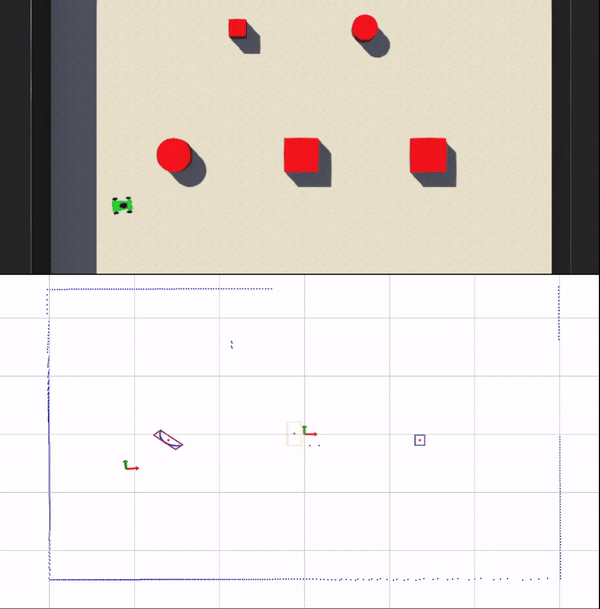

# LIDAR OBJECT DETECTION ROS2

This package provides a way of detecting both static and dynamic objects with a robot equipped with a 2D LIDAR sensor. The package obtains the readings of the 2D LIDAR and outputs the bounding boxes and estimated pose of each object based on the defined parameters.

The following two images present a webots simulation and the plot of the output of the lidar_object_detection_ros2 package.

*Lidar Object Detection demo using a simulated environment in WEBOTS.*

## Overview

In order to output the bounding boxes for each detected object, this package performs the following steps.

1. Obtain coordinates for each one of the lidar points.
2. The lidar data is clustered using DBSCAN (Density-Based Spatial Clustering of Applications with Noise).
3. Each cluster is then fitted with a rectangle using a Search-Based Rectangle Fitting algorithm developed by Zhang et al., 2017 [1].

This node subscribes to a sensor_msgs/LaserScan message containing the 2D LIDAR data and uses a transform listener to obtain the desired transform. The node outputs two custom messages, first a lidar_object_detection_ros2/msg/ObjectsArray message, which contains the information for the different detected objects, and second, a lidar_object_detection_ros2/msg/ScanClusters message, which contains the coordinates for each one of the lidar points and their respective labels obtained via the DBSCAN algorithm.

## Parameters

- **dbscan_eps:** default 0.1. The maximum distance between two samples for one to be considered as in the neighborhood of the other in the DBSCAN algorithm.
- **dbscan_min_samples:** default 5. The number of samples (or total weight) in a neighborhood for a point to be considered as a core point in the DBSCAN algorithm.
- **frame_id:** default "". Frame from which the objects are located. If leaved empty the objects a located with respect to the lidar frame.
- **lidar_frame_id:** default "laser_link". 2D LIDAR frame.
- **lidar_angular_resolution:** default 0.5. Angular resolution (in degrees) of the 2D LIDAR sensor.
- **update_rate:** default 0.1. Rate (in seconds) at which the objects are calculated and published.
- **flip_x_axis:** default False. Whether to flip the x axis of the lidar data.
- **flip_y_axis:** default False. Whether to flip the y axis of the lidar data.
- **min_l:** default 0.05. Minimum size (in meters) of a rectangle side (l1 or l2) to consider the object in the output.
- **max_L:** default 1.0. Maximum size (in meters) of a rectangle side (l1 or l2) to consider the object in the output.

## References

[1] X. Zhang, W. Xu, C. Dong, and J. M. Dolan, “Efficient l-shape fitting for vehicle detection using laser scanners,” in 2017 IEEE Intelligent Vehicles Symposium (IV), pp. 54–59, IEEE, 2017. [https://doi.org/10.1109/IVS.2017.7995698](https://doi.org/10.1109/IVS.2017.7995698)

