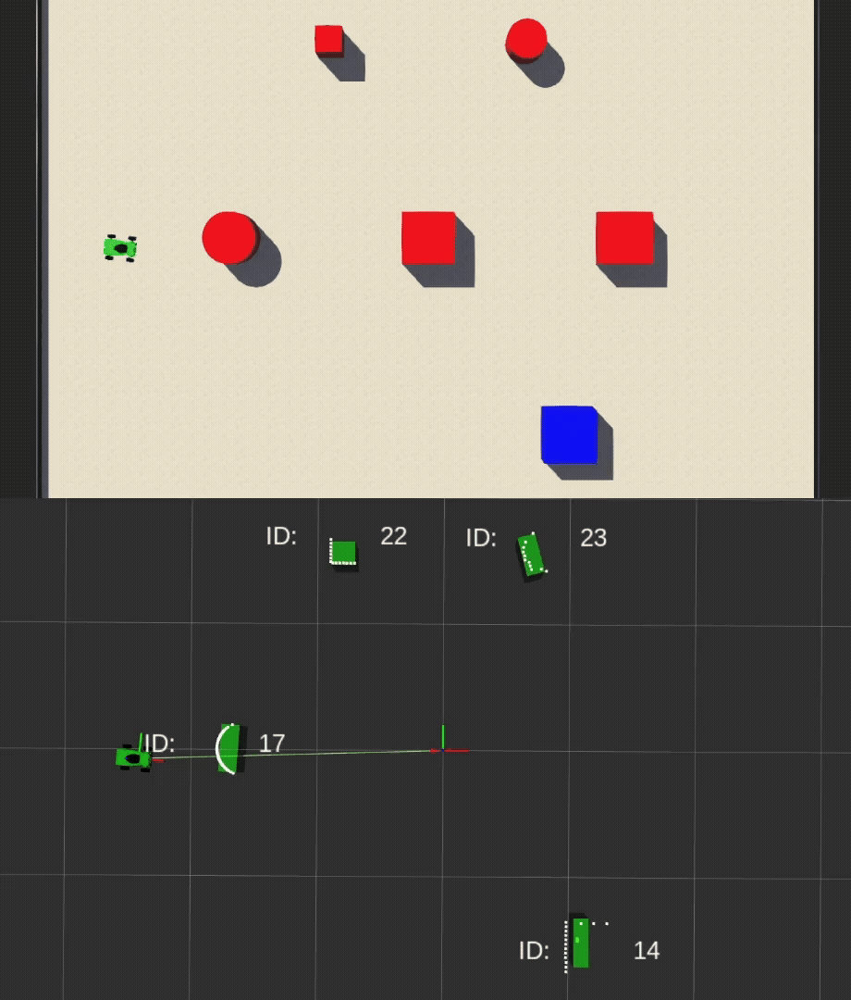

# LIDAR OBJECT DETECTION ROS2

This package provides a robust pipeline for detecting and tracking both static and dynamic objects using a 2D LIDAR sensor. It transforms raw laser scans into tracked objects with estimated poses, dimensions, and velocities.



*Lidar Object Detection demo showing clustering, L-shape fitting, and real-time tracking.*

## Features

- **L-Shape Fitting:** Implements Search-Based Rectangle Fitting to accurately represent vehicle-like or box-like geometries.
- **Multi-Object Tracking:** Uses the Hungarian Algorithm for data association and Kalman Filters to estimate object velocities and maintain IDs across frames.
- **Robust Filtering:** Includes range clipping and size-based filtering to eliminate sensor noise and robot self-reflections.
- **RViz Visualization:** Integrated support for publishing 3D bounding boxes, ID labels, and velocity vectors.

## Overview

1. **Preprocessing:** LiDAR points are clipped by range and transformed into a global or local reference frame.
2. **Clustering:** Data is grouped using **DBSCAN** (Density-Based Spatial Clustering of Applications with Noise).
3. **L-Shape Fitting:** Each cluster is fitted with an optimal rectangle side-matching algorithm [1].
4. **Tracking:** - New detections are associated with existing tracks via the **Hungarian Algorithm**.
   - A **Kalman Filter** (Constant Velocity Model) predicts and updates the state (pose and twist) of each object.

## Usage Example

You can launch the node with custom parameters using a ROS 2 launch file. Below is an example configuration that includes all the tracking and visualization settings:

```python
from launch import LaunchDescription
from launch_ros.actions import Node

def generate_launch_description():

    lidar_object_detection = Node(
        package="lidar_object_detection_ros2",
        executable="lidar_object_detection.py",
        parameters=[
            # DBSCAN Parameters
            {"dbscan_eps": 0.2},
            {"dbscan_min_samples": 5},
            # Lidar and Frame Parameters
            {"lidar_angular_resolution": 0.5},
            {"frame_id": "map"},
            {"lidar_frame_id": "lidar"},
            {"flip_x_axis": True},
            {"flip_y_axis": True},
            {"update_rate": 0.2},
            # L-shape Detection Parameters
            {"min_l": 0.05},
            {"max_l": 1.0},
            # Lidar Clipping Parameters
            {"min_range": 0.1},
            {"max_range": 8.0},
            # Kalman Filter Parameters
            {"use_kalman_filter": True},
            {"kf_q_std": 0.05},
            {"kf_r_std": 0.1},
            # Visualization Parameters
            {"publish_markers": True},
            {"color_bbox": [0.0, 1.0, 0.0, 0.5]},  # Green
            {"color_text": [1.0, 1.0, 1.0, 1.0]},  # White
            {"color_arrow": [1.0, 1.0, 0.0, 1.0]}, # Yellow
            {"min_velocity_show": 0.01},
            # Tracking/Association Parameters
            {"max_disappeared": 6},
            {"max_association_distance": 0.8}
        ],
        output="screen",
    )

    return LaunchDescription([
        lidar_object_detection,
    ])

```

## Parameters

### Clustering & Filtering
- **dbscan_eps:** (default: `0.1`) Max distance between points to be considered a cluster.
- **dbscan_min_samples:** (default: `5`) Minimum points to form a cluster.
- **min_range / max_range:** (default: `0.1` / `8.0`) Radial distance window to consider LIDAR data (meters).
- **min_l / max_l:** (default: `0.05` / `1.0`) Constraints on the allowable size of the fitted rectangle sides.

### Tracking (Kalman Filter)
- **use_kalman_filter:** (default: `True`) Enable velocity estimation and pose smoothing.
- **kf_q_std:** (default: `0.05`) Process noise (uncertainty in the motion model).
- **kf_r_std:** (default: `0.1`) Measurement noise (uncertainty in the LIDAR detections).
- **max_disappeared:** (default: `6`) Number of frames to keep a lost object before deleting its ID.
- **max_association_distance:** (default: `0.8`) Max distance (meters) to associate a detection with a track.

### Coordinate Systems & Timing
- **frame_id:** (default: `""`) Target frame (e.g., `map`). If empty, uses the LIDAR frame.
- **lidar_frame_id:** (default: `"laser_link"`) The frame of the LIDAR sensor.
- **update_rate:** (default: `0.1`) Period (seconds) for the processing loop.
- **flip_x_axis / flip_y_axis:** (default: `False`) Flags to invert axes based on sensor mounting.

### Visualization
- **publish_markers:** (default: `True`) Toggle publishing of `visualization_msgs/MarkerArray`.
- **color_bbox:** (default: `[0.0, 1.0, 0.0, 0.5]`) RGBA for bounding boxes.
- **color_text:** (default: `[1.0, 1.0, 1.0, 1.0]`) RGBA for ID labels.
- **color_arrow:** (default: `[1.0, 1.0, 0.0, 1.0]`) RGBA for velocity arrows.
- **min_velocity_show:** (default: `0.01`) Speed threshold to display velocity arrows.

## Subscriptions
- `scan` (`sensor_msgs/LaserScan`)

## Publishers
- `lod_objects` (`lidar_object_detection_ros2/msg/ObjectsArray`)
- `lod_markers` (`visualization_msgs/MarkerArray`)

## Custom Interfaces

The following custom message definitions are used to represent the detected and tracked objects.

### 1. LShape.msg

Defines the geometric properties of a fitted L-shape.

```text
geometry_msgs/Pose2D c1    # The primary corner point (x, y) and orientation (theta)
float32 l1                 # Length of the first side
float32 l2                 # Length of the second side

```

### 2. Object.msg

Contains the full state of a tracked object, including its unique ID and movement data.

```text
int32 id                   # Unique persistent ID for tracking
LShape l_shape             # Geometric L-shape properties
geometry_msgs/Pose2D pose  # The calculated center pose of the object
geometry_msgs/Twist twist  # Linear and angular velocity estimated by the Kalman Filter

```

### 3. ObjectsArray.msg

The top-level message used to publish the current list of all tracked objects.

```text
std_msgs/Header header     # Timestamp and coordinate frame information
Object[] objects           # Array of detected/tracked objects

```

## References

[1] X. Zhang, W. Xu, C. Dong, and J. M. Dolan, “Efficient l-shape fitting for vehicle detection using laser scanners,” in 2017 IEEE Intelligent Vehicles Symposium (IV), pp. 54–59, IEEE, 2017. [https://doi.org/10.1109/IVS.2017.7995698](https://doi.org/10.1109/IVS.2017.7995698)